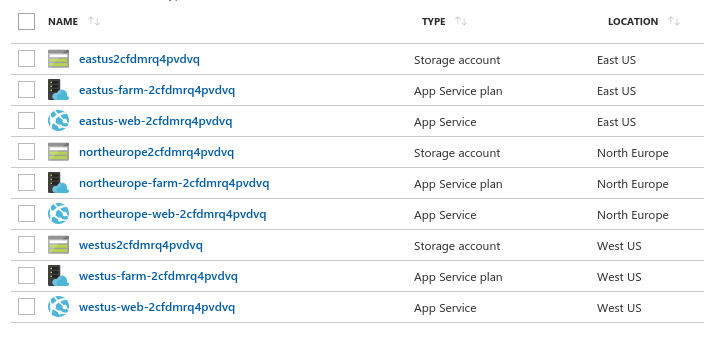
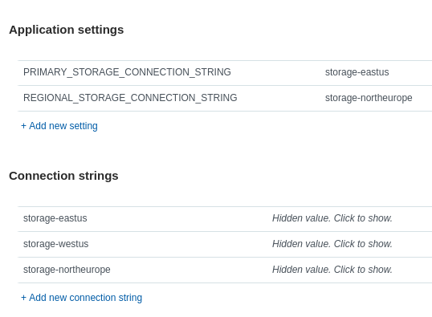

# Multi-region Azure Service

<a href="https://portal.azure.com/#create/Microsoft.Template/uri/https%3A%2F%2Fraw.githubusercontent.com%2Fwdecay%2Fmulti-region-service-demo%2Fmaster%2Fazuredeploy.json" target="_blank">
    
</a>

## Overview


## Requirements

1. Regional App Service instances need read-only access to blob storage of regional storage accounts.
2. One of the storage accounts is designated as primary; in addition to blobs, this account contains tables used across all the regions.
3. The service needs to support atomic and synchronous bulk writes into each regional blob storage (this feature, however, is on a deprecation path in favor of a more simple approach).


## High-level design

To satisfy reqirements 1, 2 and 3, each regional App Service needs to, respectively:

1. be aware of its assigned regional storage
2. be aware of the designated primary storage
3. be aware of all existing storage accounts.

This can be achieved by making Connection Strings and App Settings work together.

### Making Connection Strings and App Settings work together

Let all regional App Services contain a full set of connection strings pointing to every regional storage account with names of the Connection Strings being in the form of `storage-<location>`.

Given that Connection Strings pointing to all storage accounts are now available, regional and primary storages for each App Service can be designated by adding two indexer App Settings &mdash; one containing the name of the primary connection string, and another containing the name of the regional connection string. For example:

```json
{
    "PRIMARY_STORAGE_CONNECTION_STRING": "storage-eastus",
    "REGIONAL_STORAGE_CONNECTION_STRING": "storage-westus"
}
```

Resolving connection strings for both storage accounts within the service is now trivial:

```python
primary_storage = connection_strings[app_settings['PRIMARY_STORAGE_CONNECTION_STRING']]
regional_storage = connection_strings[app_settings['REGIONAL_STORAGE_CONNECTION_STRING']]
```

### Example

Suppose, the service is deployed to 3 Azure regions: East US, North Europe and West US.


Connection Strings annd App Settings of the App Service deployed in North Europe would look like this:


## Proof-of-concept implementation

https://docs.microsoft.com/en-us/azure/azure-resource-manager/resource-group-create-multiple


https://docs.microsoft.com/en-us/azure/azure-resource-manager/resource-group-create-multiple#resource-iteration


https://docs.microsoft.com/en-us/azure/azure-resource-manager/resource-group-create-multiple#property-iteration


https://docs.microsoft.com/en-us/azure/azure-resource-manager/resource-group-create-multiple#variable-iteration